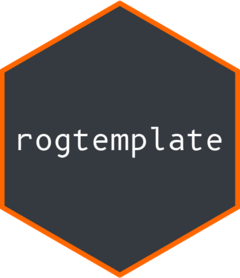

<!-- README.md is generated from README.Rmd. Please edit that file -->

```{r, include = FALSE}
knitr::opts_chunk$set(
  collapse = TRUE,
  comment = "#>",
  tidy = "styler",
  fig.path = "man/figures/README-",
  out.width = "100%"
)
```

# rogtemplate <a href='https://ropengov.github.io/rogtemplate/'></a>

<!-- badges: start -->
[](https://ropengov.org/)
[](https://github.com/rOpenGov/rogtemplate/actions)
[](https://ropengov.r-universe.dev/)
[](https://lifecycle.r-lib.org/articles/stages.html#experimental)
<!-- badges: end -->


This package is a **pkgdown** template adapted to 
[rOpenGov](https://ropengov.org/) site.

This is a private template for use by core rOpenGov packages. 
Please don’t use it for your own code.


## Using rogtemplate

It is possible to deploy your **pkgdown** site along with **rogtemplate**
via CI (GitHub Actions) or locally, that provides more control but it is
not automatic.

### Option A: Deploy using GitHub Actions

It is not necessary to install **rogtemplate** itself. Just copy 
[this file](https://github.com/rOpenGov/rogtemplate/blob/main/inst/yaml/rogtemplate-gh-pages.yaml) 
into your `.github/workflows/` folder.

The action would create your site in the `gh-pages` branch.

### Option B: Deploy installing rogtemplate


You can install **rogtemplate** using the
[r-universe](https://ropengov.r-universe.dev/ui):

```{r, eval=FALSE}
# Enable this universe
options(repos = c(
  ropengov = "https://ropengov.r-universe.dev",
  CRAN = "https://cloud.r-project.org"
))

# Install some packages
install.packages("rogtemplate")
```

You can use also the **remotes** package:

``` r
library(remotes)
install_github("ropengov/rogtemplate", dependencies = TRUE)
```

You can use `rog_actions_pkgdown_branch()`
for setting up the action described before but the deployment would be still
performed by a GitHub action.

For building locally your package into your `docs` folder use:

``` r

rogtemplate::rog_build()

# or you can use also

rogtemplate::rog_add_template_pkgdown()
pkgdown::build_site()
```

Note that `rogtemplate::rog_add_template_pkgdown()` creates a `_pkgdown.yml` 
file (or modify an existing one) with the following lines:

```yaml

template:
  package: rogtemplate
```

These lines tells **pkgdown** to use **rogtemplate**.


## Commit to GitHub and deploy

Last step is commit to GitHub, wait until the GitHub action ends (in the
case you chose to deploy in that way) and deploy the website via
*YOUR\_GITHUB\_REPO\>Settings\>GitHub Pages*.


## Extras

We provide also some additional extra functions for creating badges and logos,
see [Extras](https://ropengov.github.io/rogtemplate/reference/index.html) for more info.
