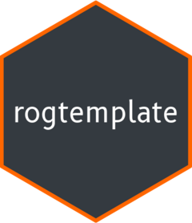

<!-- README.md is generated from README.Rmd. Please edit that file -->

```{r}
#| include: false
knitr::opts_chunk$set(
  collapse = TRUE,
  comment = "#>",
  tidy = "styler",
  fig.path = "man/figures/README-",
  out.width = "100%"
)
```

# rogtemplate <a href='https://ropengov.github.io/rogtemplate/'></a>

<!-- badges: start -->

[](https://ropengov.org/)
[](https://github.com/rOpenGov/rogtemplate/actions)
[](https://ropengov.r-universe.dev/rogtemplate)
[](https://www.repostatus.org/#concept)

<!-- badges: end -->

**rogtemplate** is a private **pkgdown** template for core
[rOpenGov](https://ropengov.org/) package sites. It provides site setup
helpers, package asset helpers and rOpenGov color palettes.

Please do not use it for your own code.

## Using rogtemplate

You can deploy your **pkgdown** site with **rogtemplate** through a GitHub
Action or build it locally. The GitHub Action is automatic after setup. A local
build gives you more control.

### Option A: Deploy with a GitHub Action

You do not need to install **rogtemplate** itself. First copy [this
workflow file](https://github.com/rOpenGov/rogtemplate/blob/main/inst/yaml/rogtemplate-gh-pages.yaml)
to your `.github/workflows/` folder.

Then go to *YOUR_GITHUB_REPO > Settings > Pages* and configure GitHub Pages to
publish from the `gh-pages` branch.

### Option B: Build after installing rogtemplate

You can install **rogtemplate** from
[r-universe](https://ropengov.r-universe.dev/rogtemplate):

```{r}
#| eval: false
install.packages("rogtemplate",
  repos = c("https://ropengov.r-universe.dev", "https://cloud.r-project.org")
)
```

You can also use the **pak** package:

```{r}
#| eval: false
pak::pak("ropengov/rogtemplate")
```

Use `rog_actions_pkgdown_branch()` to set up the workflow described above. The
deployment is still performed by a GitHub Action.

To build your package locally into the `docs` folder, use:

```{r}
#| eval: false
rogtemplate::rog_build()

# or use

rogtemplate::rog_add_template_pkgdown()
pkgdown::build_site()
```

`rogtemplate::rog_add_template_pkgdown()` creates a `_pkgdown.yml` file or
modifies an existing one, with these lines:

``` yaml
template:
  bootstrap: 5
  package: rogtemplate
```

These lines tell **pkgdown** to use **rogtemplate**.

## Commit to GitHub and deploy

The last step is to commit to GitHub. If you use the GitHub Action workflow,
wait until it finishes, then configure GitHub Pages from
*YOUR_GITHUB_REPO > Settings > Pages*.

## Package assets and palettes

**rogtemplate** also provides package asset helpers for badges, logos and fonts,
plus rOpenGov color palettes. See the
[reference index](https://ropengov.github.io/rogtemplate/reference/index.html)
for details.
