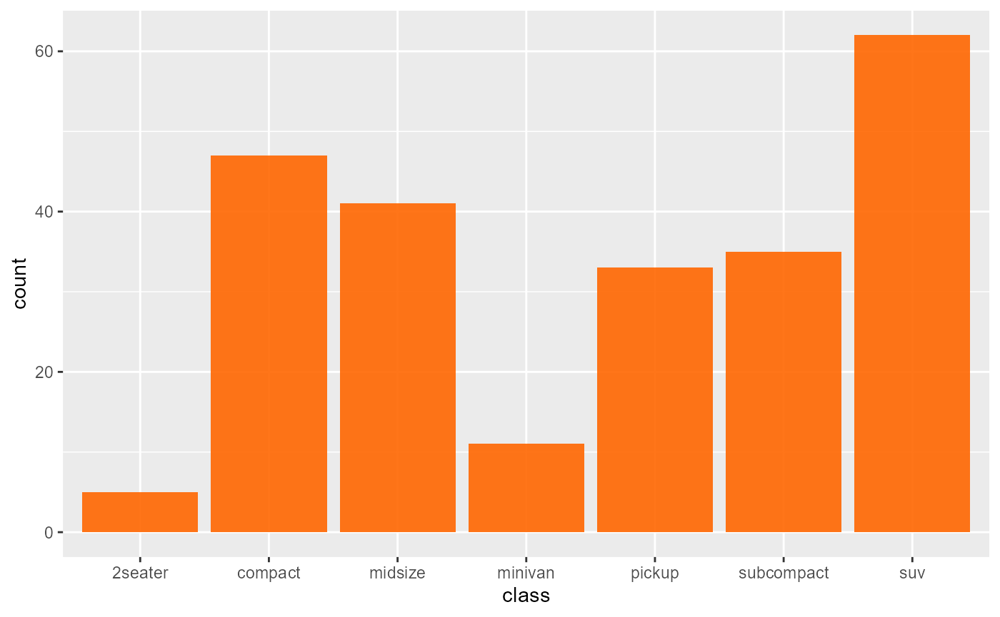

# ggplot2 example

Example on a **ggplot2** image

``` r
library(ggplot2)
library(rogtemplate)

# counts (or sums of weights)
g <- ggplot(mpg, aes(class))

# Number of cars in each class:
g + geom_bar(fill = rog_orange_pal(1))
```



A ggplot2 image
